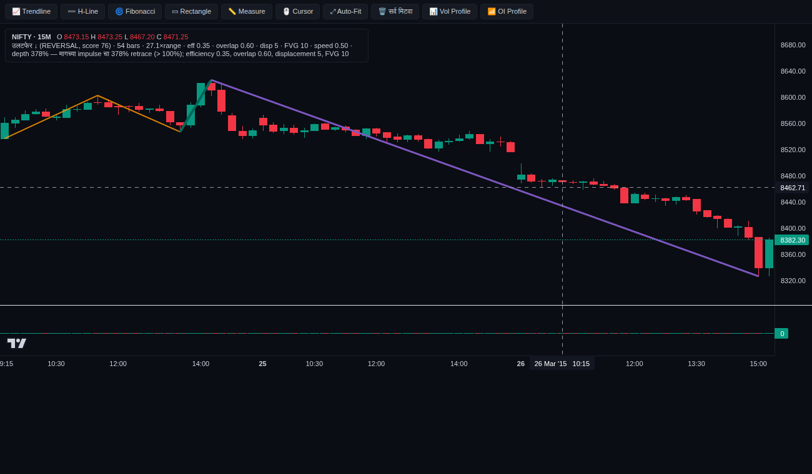
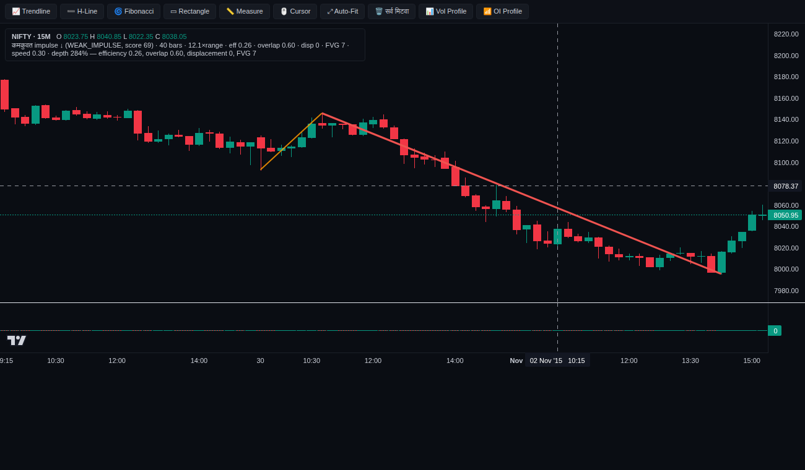
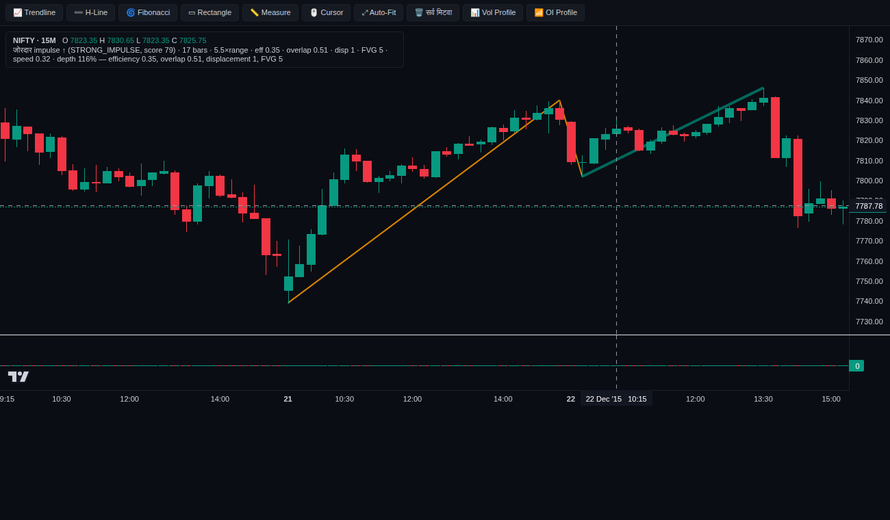
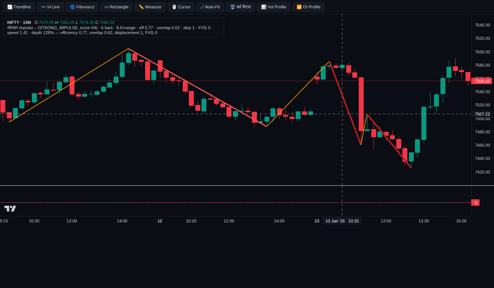
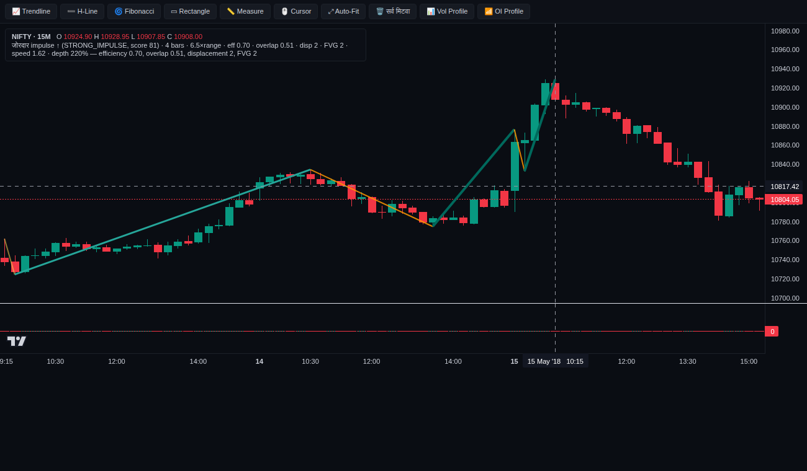
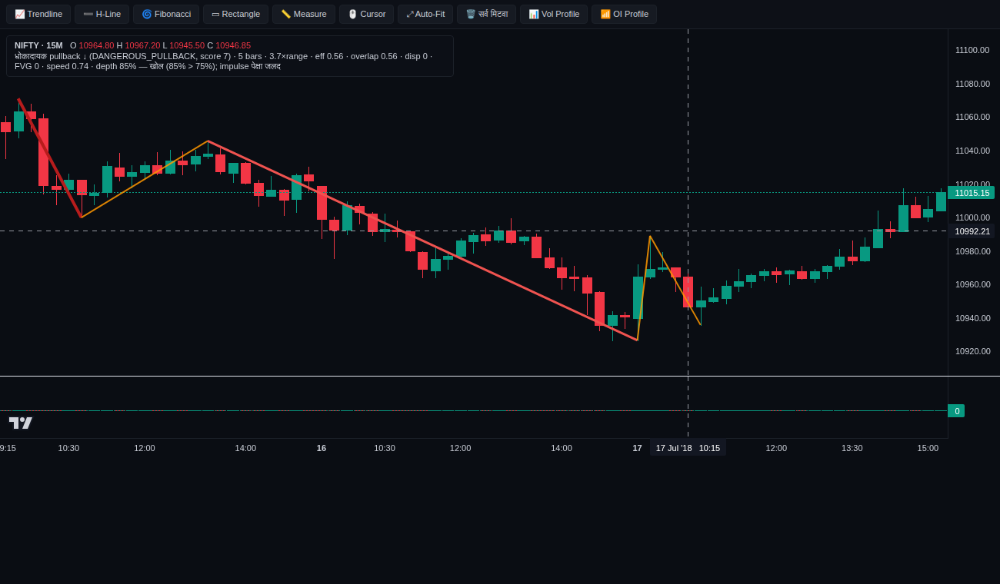
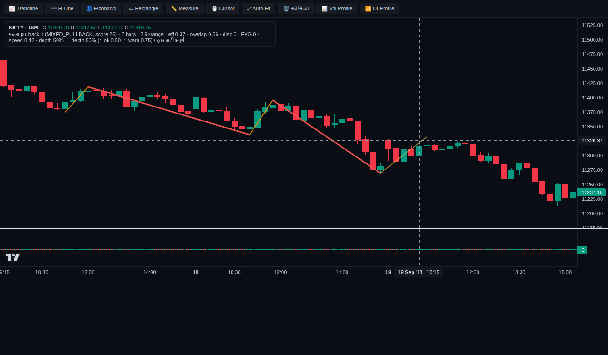
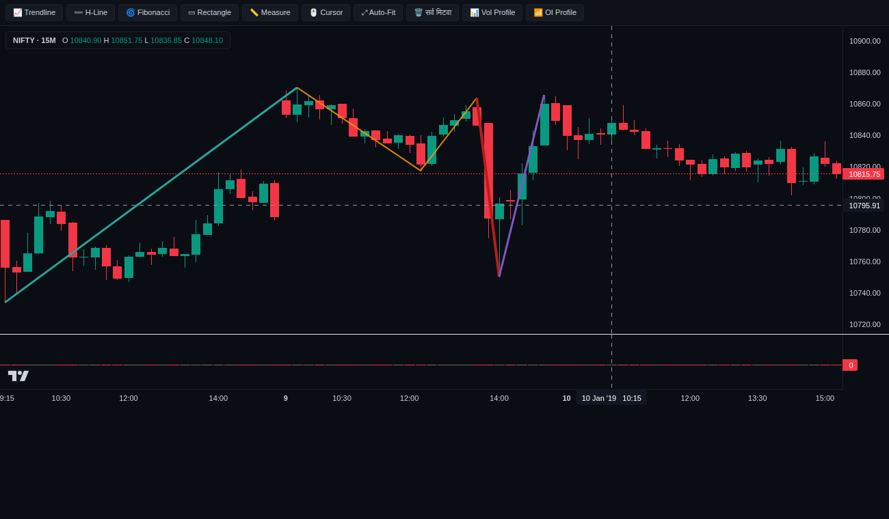
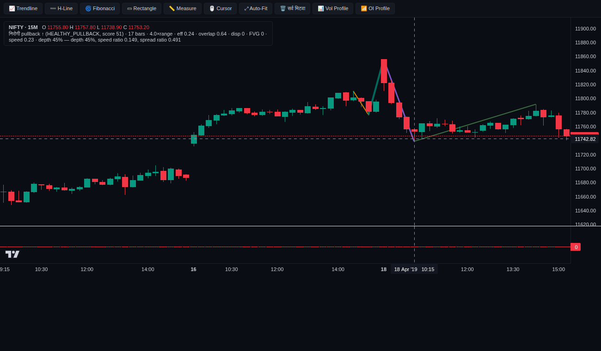
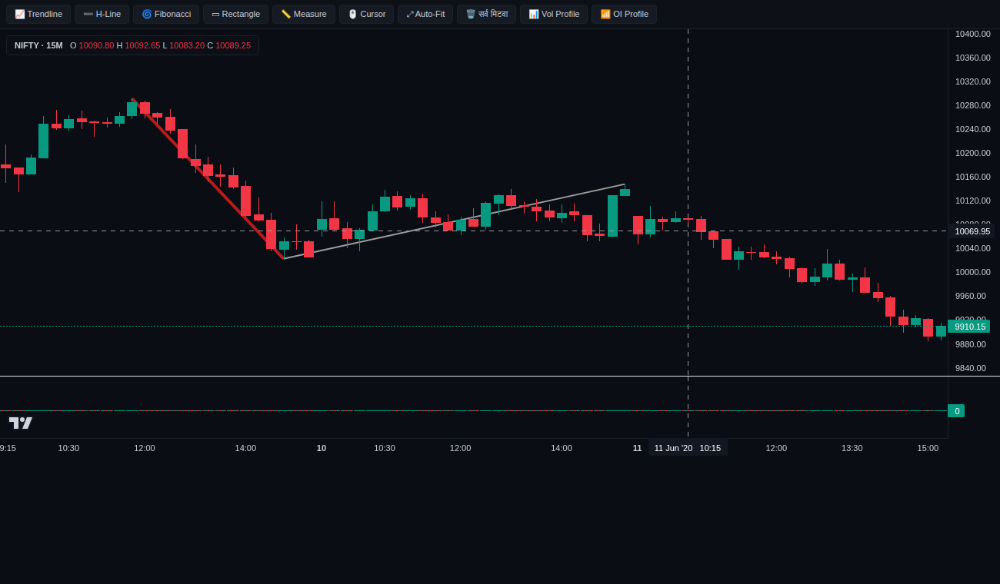

# T2.1–T2.3 — Leg classifier: IS calibration आणि G1 नमुने (NIFTY 15M)

डेटा: `data/nifty50_1min.parquet` → 15M (56816 bars). IS = 2015→2021 (calibration फक्त इथे), VAL = 2022→2024-03 (फक्त दाखवणे). Sealed holdout वापरलेला नाही.
परिणाम-क्षितिज H = 8 bars (15M ⇒ 2 तास). fwd_mr = leg माहीत झाल्यापासून (confirm bar) H bars नंतरचा close-बदल, leg दिशेने, ÷ median_range.

## 1. आधीच ठरलेले grids (प्रत्येकी 81) आणि निवड

- Impulse grid {'e_hi': (0.35, 0.45, 0.55), 'o_lo': (0.45, 0.55, 0.65), 'd_k': (1.0, 1.5, 2.0), 'd_body': (0.5, 0.6, 0.7)} — उद्दिष्ट: STRONG वि. WEAK fwd_mr फरकाचा Welch t (STRONG वाटा 10%–60%).
  - निवड: **{'e_hi': 0.35, 'o_lo': 0.65, 'd_k': 1.5, 'd_body': 0.5}** · पात्र trials: 58/81 · t ची रेंज -0.78 → 1.62
- Pullback grid {'r_ok': (0.4, 0.5, 0.6), 'r_warn': (0.7, 0.85, 1.0), 's_ratio': (0.6, 0.8, 1.0), 'fvg_min': (0.1, 0.25, 0.5)} — उद्दिष्ट: HEALTHY वि. DANGEROUS resume दराचा z (दोन्ही वाटे ≥ 10%).
  - निवड: **एकही trial अट पूर्ण करत नाही ⇒ डीफॉल्ट ठेवले** · HEALTHY वाटा रेंज 0.008 → 0.059, DANGEROUS 0.836 → 0.962
- अंतिम LegConfig: `{'n_median': 20, 'fractal_r': 2, 'k_internal': 1.5, 'k_swing': 3.0, 'e_hi': 0.35, 'o_lo': 0.65, 'd_k': 1.5, 'd_body': 0.5, 'fvg_min': 0.1, 'r_ok': 0.5, 'r_warn': 0.75, 's_ratio': 0.8, 'healthy_max_dir': 0.8, 'e_range': 0.15, 'o_range': 0.55, 'alt_range': 0.5}`

## 2. IS वि. VAL (निवडलेल्या cfg ने, एकाच सलग चालवणीत)

| मापक | IS | VAL |
|---|---|---|
| period | IS 2015→2021 | VAL 2022→2024-03 |
| legs | 3109 | 1006 |
| n_impulse | 1048 | 346 |
| strong_share | 0.495 | 0.520 |
| fwd_strong | 0.194 | -0.100 |
| fwd_weak | -0.148 | -0.090 |
| t | 1.622 | -0.030 |
| n_pullback | 1566 | 515 |
| healthy_share | 0.014 | 0.010 |
| danger_share | 0.958 | 0.965 |
| resume_healthy | 0.909 | 1.000 |
| resume_danger | 0.658 | 0.651 |
| z | 2.469 | 1.632 |
| share_DANGEROUS_PULLBACK | 0.483 | 0.494 |
| share_WEAK_IMPULSE | 0.170 | 0.165 |
| share_STRONG_IMPULSE | 0.167 | 0.179 |
| share_REVERSAL | 0.155 | 0.139 |
| share_MIXED_PULLBACK | 0.014 | 0.013 |
| share_HEALTHY_PULLBACK | 0.007 | 0.005 |
| share_RANGE | 0.004 | 0.005 |

## 3. लेबलनिहाय पुढचे परिणाम

| period | label | n | fwd_mr_mean | fwd_pos_pct | resume_pct |
|---|---|---|---|---|---|
| IS | DANGEROUS_PULLBACK | 1501 | -0.212 | 47.100 | 65.800 |
| IS | HEALTHY_PULLBACK | 22 | -1.483 | 31.800 | 90.900 |
| IS | MIXED_PULLBACK | 43 | 0.674 | 44.200 | 86.000 |
| IS | RANGE | 12 | 1.055 | 66.700 | 50.000 |
| IS | REVERSAL | 483 | 0.043 | 51.300 |  |
| IS | STRONG_IMPULSE | 519 | 0.194 | 54.100 |  |
| IS | WEAK_IMPULSE | 529 | -0.148 | 47.100 |  |
| VAL | DANGEROUS_PULLBACK | 497 | -0.293 | 46.700 | 65.100 |
| VAL | HEALTHY_PULLBACK | 5 | 0.060 | 60.000 | 100.000 |
| VAL | MIXED_PULLBACK | 13 | -0.833 | 30.800 | 92.300 |
| VAL | RANGE | 5 | -1.424 | 20.000 | 100.000 |
| VAL | REVERSAL | 140 | 0.581 | 55.700 |  |
| VAL | STRONG_IMPULSE | 180 | -0.100 | 48.300 |  |
| VAL | WEAK_IMPULSE | 166 | -0.090 | 50.600 |  |

## 4. G1 — 10 नमुना दिवस (IS, स्थिर seed; प्रत्येक लेबल किमान एकदा)

| दिवस | legs (3 दिवसांत) | लेबल्स |
|---|---|---|
| 2015-03-26 (Thu) | 4 | DANGEROUS_PULLBACK 2, STRONG_IMPULSE 1, REVERSAL 1 |
| 2015-11-02 (Mon) | 2 | DANGEROUS_PULLBACK 1, WEAK_IMPULSE 1 |
| 2015-12-22 (Tue) | 3 | DANGEROUS_PULLBACK 2, STRONG_IMPULSE 1 |
| 2016-01-13 (Wed) | 6 | DANGEROUS_PULLBACK 3, STRONG_IMPULSE 2, WEAK_IMPULSE 1 |
| 2018-05-15 (Tue) | 6 | DANGEROUS_PULLBACK 2, STRONG_IMPULSE 2, MIXED_PULLBACK 1, WEAK_IMPULSE 1 |
| 2018-07-17 (Tue) | 5 | DANGEROUS_PULLBACK 3, STRONG_IMPULSE 1, WEAK_IMPULSE 1 |
| 2018-09-19 (Wed) | 5 | DANGEROUS_PULLBACK 2, WEAK_IMPULSE 2, MIXED_PULLBACK 1 |
| 2019-01-10 (Thu) | 5 | DANGEROUS_PULLBACK 2, WEAK_IMPULSE 1, STRONG_IMPULSE 1, REVERSAL 1 |
| 2019-04-18 (Thu) | 4 | DANGEROUS_PULLBACK 1, STRONG_IMPULSE 1, REVERSAL 1, HEALTHY_PULLBACK 1 |
| 2020-06-11 (Thu) | 2 | STRONG_IMPULSE 1, RANGE 1 |

चार्ट: `--out` folder मधील `legs_YYYY-MM-DD.html` (interactive; गडद = impulse, फिकट = pullback, राखाडी = range, जांभळा = उलटफेर; hover वर features + कारण).
प्रत्येक दिवसाचा (मागच्या 2 दिवसांच्या संदर्भासह) screenshot खाली — वरच्या कोपऱ्यातली पेटी = crosshair खालच्या leg ची माहिती.
Dashboard वर: चार्ट खाली **"Legs (impulse / pullback लेबल)"** checkbox (डीफॉल्ट बंद).

## 5. निष्कर्ष (हाताने लिहिलेला)

1. **Swings → legs रचना चार्टवर तर्कसंगत दिसते** (वरचे 10 नमुने): ZigZag (3 × median_range) मुख्य swings पकडतो. legs फक्त confirm झाल्यावर (`known_at`) लेबल होतात.
   No-lookahead independent review मध्ये prefix-test ने तपासलं.
2. **STRONG वि. WEAK impulse:** IS वर सर्वोत्तम grid trial चा फरक t = 1.62 (5% स्तरावर महत्त्वाचा नाही). VAL मध्ये फरक ≈ 0 (t = −0.03).
   ⇒ 15M / 2-तास क्षितिजावर "जोरदार impulse नंतर तीच दिशा चालू राहते" याचा पुरावा **नाही**.
3. **Pullback लेबल्स:** spec चे "धोकादायक" नियम OR ने जोडलेले आहेत (खोल > r_warn, किंवा pullback-दिशेचा displacement/FVG, किंवा speed ≥ impulse speed, किंवा CHoCH + displacement).
   - NIFTY 15M वर speed ≥ impulse 57%, displacement/FVG 62%, depth > 0.75 31% pullbacks मध्ये. म्हणून ~96% pullbacks DANGEROUS, आणि HEALTHY फक्त ~1%.
   - ठरवलेल्या pullback grid मधला एकही trial "दोन्ही ≥ 10%" अट पूर्ण करत नाही ⇒ डीफॉल्ट ठेवले (post-hoc सैल केलं नाही).
4. HEALTHY दिसतो तेव्हा trend resume 90.9% (IS, n = 22) वि. DANGEROUS 65.8% (n = 1501). VAL: 5/5 वि. 65.1%. दिशा आशादायक, पण नमुना फार लहान.
5. **G1 साठी प्रस्ताव (तुमचा निर्णय):**
   - (a) व्याख्या जशा आहेत तशा ठेवा. Approach-rule मध्ये फक्त STRONG_IMPULSE ⇒ BREAK candidate वापरा.
   - (b) नवीन, आधीच ठरवलेलं गृहीतक: "धोकादायक = 4 पैकी ≥ 2 अटी". IS वर नवा grid, VAL वेगळा.
   - हे bot मध्ये नाही; overlay डीफॉल्ट बंद.
6. Independent review नंतर दुरुस्ती: depth आता खरा किंमत-retrace (आधी दोन legs च्या वेगवेगळ्या mr मुळे गोंधळ). वरचे सर्व आकडे दुरुस्तीनंतरचे.
